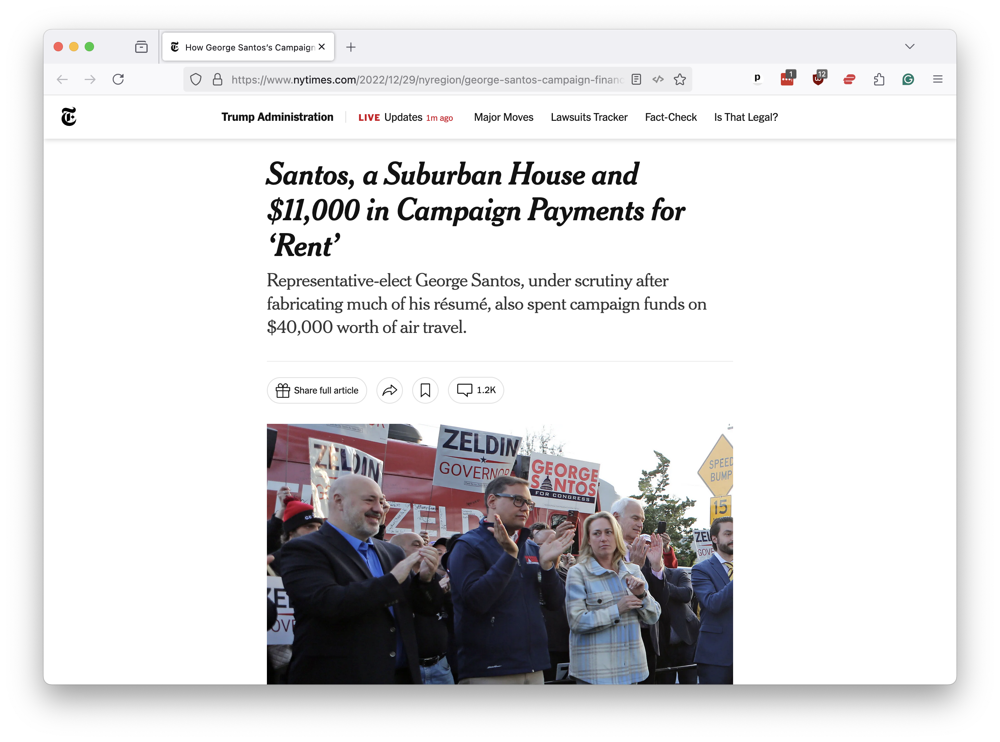

# What we'll do

Journalists frequently encounter the mountains of messy and unstructured data generated by our world, a vast and verbose corpus that boasts everything from long-hand entries in police reports to the legalese of legislative bills.

Understanding and analyzing this data is critical to the job, but it can be time-consuming and error-prone. Computers can help by automating the process of sorting through large blocks of text, extracting key details, and flagging unusual patterns.

A common goal in this work is to classify text into categories. For example, you might want to sort a collection of emails into “spam” and “not spam” categories or identify corporate filings that suggest a company is about to go bankrupt.

Traditional techniques for classifying text, like keyword searches or regular expressions, can be brittle and error-prone. Machine learning models can be more flexible, but they require large amounts of labeled training data and a significant amount of computer programming expertise, for the results are often unimpressive.

This class teaches you how to use a large-language model for better results. We will demonstrate how, with a few well-crafted prompts, you can get structured, meaningful responses in a more efficient and accurate way than other methods.

## Our example case

To demonstrate the power of this approach, we’ll focus on a specific data set: campaign expenditures.

Political campaigns spend money on everything from pizza to private jets, which must be disclosed in a public database. Tracking that spending can reveal patterns that might otherwise go unnoticed and sometimes lead to important stories.

But the data is messy. Campaigns often use vague or misleading descriptions for their expenses, making it difficult to spot patterns. There’s also a lot of it. With hundreds of candidates logging thousands of transactions, no one can read through it all.

It wasn’t until after his 2022 election to Congress that [journalists discovered](https://www.nytimes.com/2022/12/29/nyregion/george-santos-campaign-finance.html) that Rep. George Santos of New York had spent thousands of campaign dollars on questionable and potentially illegal expenses. Many of these expenses were publicly disclosed in his campaign finance reports, but they were buried in a sea of other transactions and largely overlooked before election day.

Inspired by this story, we will create a classifier that can scan the expenditures logged in campaign finance reports and identify those that may be questionable or newsworthy.

We will draw our data from California, where the California Civic Data Coalition developed a clean, structured version of the state's campaign finance database. It contains millions of transactions from thousands of campaigns for our model to review.